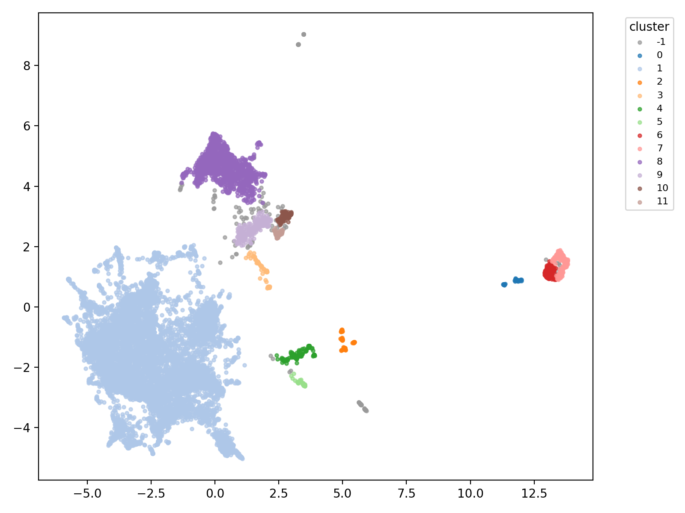
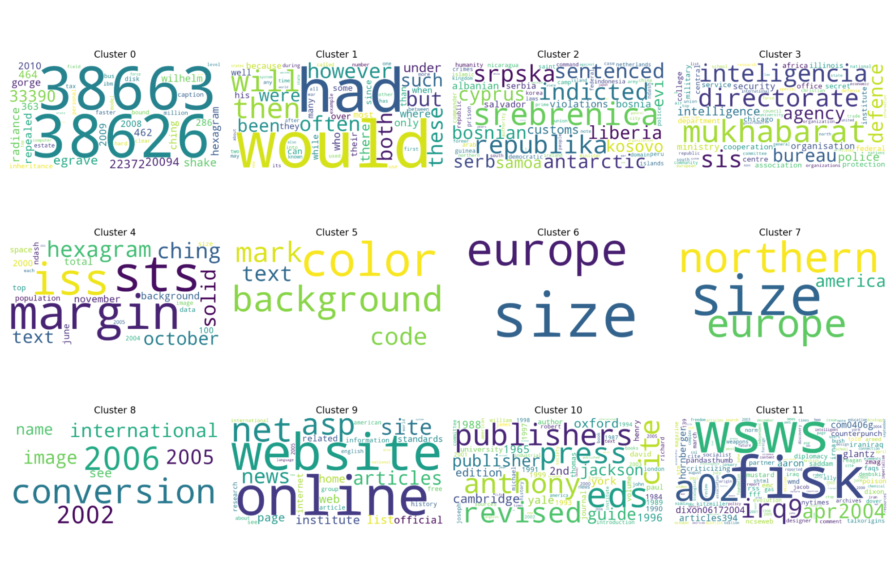
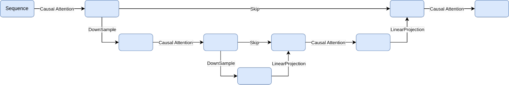
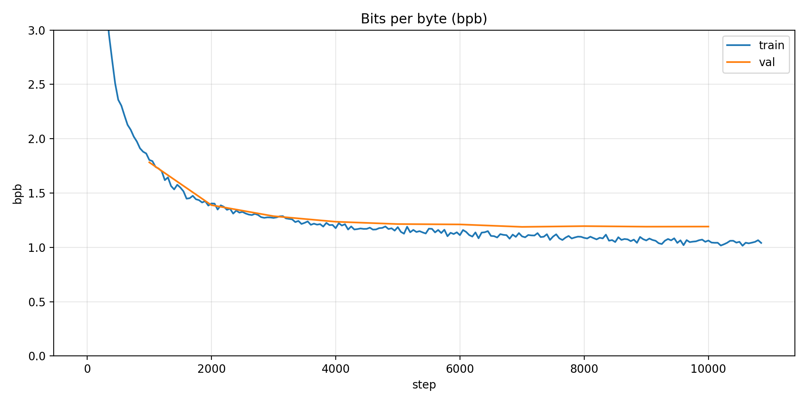
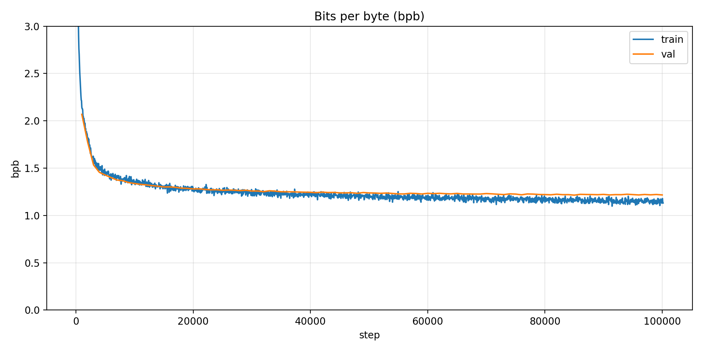

## enwik8 UNet Language Model (Simple Hierarchical Transformer)

This repo explores a simple UNet-style autoregressive language model on **enwik8** and compares it against a size-matched dense Transformer baseline.

The goal was not to build a complex tokenizer-inside-the-model system, but to test whether a **fixed, simple hierarchical compression/expansion pattern** can keep quality close to a standard Transformer while reducing compute and memory.

## Contents

- [Motivation](#motivation)
- [Model Design](#model-design)
- [Curves](#curves)
- [Results](#results)
- [Quickstart](#quickstart)

<p align="center">
  
  
</p>
<p align="center"><em>
Left: 2D UMAP of bottleneck embeddings from random test spans. Right: cluster-enriched word clouds from those same bottleneck clusters.
</em></p>

## Motivation

The core idea is to introduce a contracting-expanding pathway in a causal language model:

- Downsample sequence representations in stages.
- Process a compressed bottleneck.
- Upsample back to full length for next-token prediction.

This gives a UNet-style compute pattern where much of the expensive processing happens at shorter sequence lengths.

## Model Design

### Baseline Transformer

- Byte-level vocab (`256`)
- `dim=512`, `heads=8`, `SwiGLU`, `RMSNorm`, `RoPE`
- 10 layers

### Simple UNet Transformer

- Same core block choices as baseline (`dim=512`, `heads=8`, `SwiGLU`, `RMSNorm`, `RoPE`)
- Hierarchical sequence scales with window sizes: `[4, 4, 2, 2]`
- Fixed embedding dimension through encoder/decoder
- Causal downsampling via first-token window representative
- Learned upsampling via projection + reshape
- UNet skip connections across matching scales

Architecture schematic:



### Practical comparison (approx)

- Params: baseline ~42M, UNet ~43M
- FLOPs per forward: baseline ~107 GFLOPs, UNet ~27 GFLOPs
- KV-cache memory (inference): baseline ~20 MB, UNet ~5 MB

## Training Setup

- Dataset: `enwik8` (byte-level)
- Hardware: NVIDIA A10 24GB
- Baseline run: ~9h, ~11k steps, batch 32, grad accum 8
- UNet run: ~21h, ~100k steps, batch 128, grad accum 2

## Curves

<p align="center">
  
  
</p>
<p align="center"><em>
Left: baseline Transformer metrics. Right: simple UNet metrics.
</em></p>

## Results

- Final test bpb (baseline): **1.19**
- Final test bpb (UNet): **1.20**

The key outcome is that both models plateau in nearly the same region. The dense baseline is slightly ahead in the recorded run, and if training were extended, the most likely change is that baseline lead grows only slightly (roughly a few hundredths, e.g. ~0.03-0.04 bpb at most), not a large late-stage separation.

So the main result is:

- **Quality:** near-parity with dense Transformer at this scale.
- **Efficiency:** substantial reduction in estimated compute and KV-cache footprint for the UNet design.

## Bottleneck Embedding Analysis

The UNet bottleneck behaved like a meaningful latent space in downstream analysis:

- Random test spans were embedded at the bottleneck.
- UMAP + HDBSCAN revealed coherent topical clusters.
- Cluster-level term enrichment and word clouds showed interpretable themes (for example, technical/security-heavy spans, historical conflict clusters, citation/link-heavy text neighborhoods, and generic prose background clusters).

More concretely, several clusters were especially distinctive:

- One cluster was anchored by I Ching terminology (for example: "hexagram", "ching", "wilhelm"), suggesting a coherent niche topic.
- Another grouped intelligence/security-agency language (for example: "mukhabarat", "directorate", "agency", "security").
- A separate cluster concentrated Balkans war-crimes terms (for example: "srebrenica", "srpska", "indicted", "sentenced"), indicating a strong geopolitical/human-rights theme.
- Another appeared to capture citation/external-links neighborhoods, including outlet-like tokens and reference-heavy text structure.
- Larger background clusters were dominated by common function words and read more like generic prose rather than a single topic.

This indicates the compressed representation is not only computationally useful, but also semantically structured.

UMAP projection of bottleneck embeddings:


Cluster-enriched word cloud view:


## Takeaway

A simple hierarchical UNet-style Transformer can stay competitive with a dense baseline on enwik8 while being much cheaper in estimated compute/memory. At this scale, it does not beat the baseline on bpb, but it demonstrates a strong quality-efficiency tradeoff and useful latent structure in the bottleneck.

## Quickstart

### 1) Install dependencies

```bash
uv sync
```

### 2) Download enwik8 data

This project expects the raw file at `data/enwik8` (no extension).

```bash
mkdir -p data
cd data
wget http://mattmahoney.net/dc/enwik8.zip
unzip -o enwik8.zip
cd ..
```

### 3) Run training

Model selection is controlled by `MODEL_TYPE` in [config.py](/mnt/mnemo9/mpelus/experiments/enwik8unet/config.py):

- `MODEL_TYPE = "baseline"`
- `MODEL_TYPE = "unet"`

Also set `WORK_DIR` to the output folder you want for that run.

Start training:

```bash
uv run python train_enwik8.py
```

### 4) Evaluate a trained checkpoint

Baseline:

```bash
uv run python scripts/eval_test_bpb.py \
  --work-dir runs/enwik8_baseline \
  --ckpt ckpt_best.pt \
  --model baseline
```

UNet:

```bash
uv run python scripts/eval_test_bpb.py \
  --work-dir runs/enwik8_unet \
  --ckpt ckpt_best.pt \
  --model unet
```
